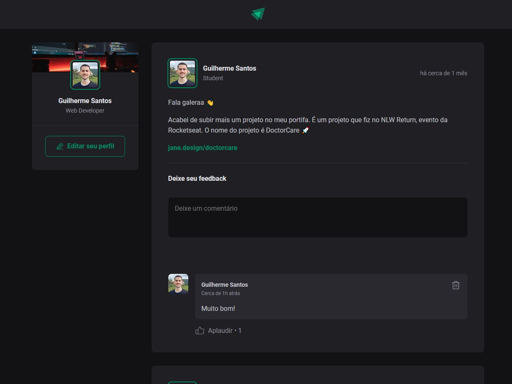

# <h1 align="center">Ignite Feed</h1>

The application has the interface with a posts and comments area. You can comment, like and delete comments.

  <a href="#-Funcionalities">Funcionalities</a>&nbsp;&nbsp;&nbsp;|&nbsp;&nbsp;&nbsp;
  <a href="#-Technologies">Technologies</a>&nbsp;&nbsp;&nbsp;|&nbsp;&nbsp;&nbsp;
  <a href="#-License">License</a>

  

# ✔ Funcionalities

- Add Comment
- Like Comment
- Delete Comment
  
## 🚀 Technologies

- ReactJS
- TypeScript
- ViteJS

## 📝 License

  

 
